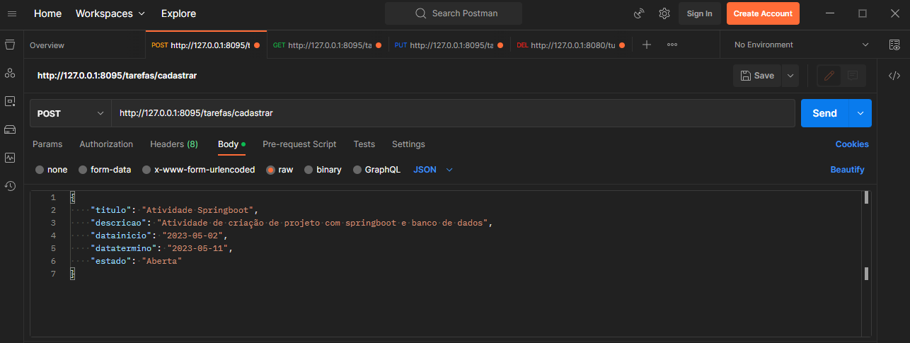
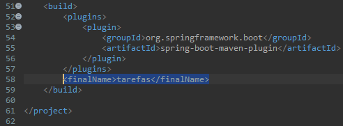
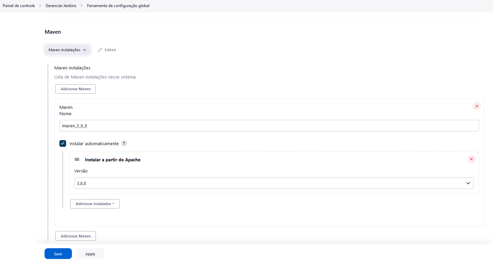
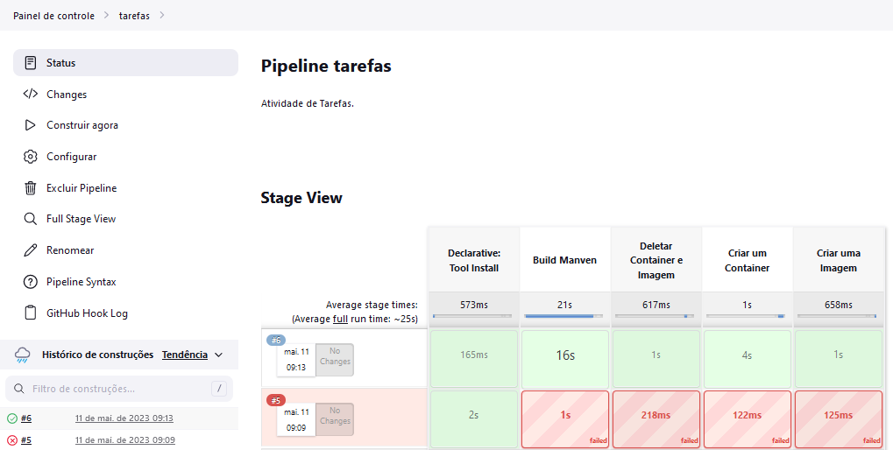

# Atividade com Sprinboot

[](https://www.eclipse.org/downloads/packages/release/2023-03/r/eclipse-ide-java-developers)
[](https://openjdk.org/)
[](https://spring.io/)
[](https://www.postman.com)
[](https://maven.apache.org)
[](https://www.mysql.com)
[](https://www.jenkins.io)
[](https://www.docker.com)
[](https://git-scm.com)

Esta atividade teve como objetivo praticar o que foi desenvolvido sobre Springboot e a automatização do GitHub pelo Jenkins, para isso, foi usado a linguagem Java e o banco de dados com MySQL.

## Tarefas

Nesta Atividade foi proposto um cenário onde um usuário precisava organizar suas tarefas de forma mais rapida e eficiente, a aplicação fornece atendimento às necessidade do usuário, permitindo as seguintes funções:

- Listar as Tarefas Cadastradas;
- Listar as tarefas pelo titulo cadastrado;
- Listar as tarefas filtradas pelo estado delas("Aberto" ou "Finalizado");
- Cadastrar novas tarefas;
- Atualizar as informações de tarefas existentes.

---
## Criando o Banco de Dados

A primeira etapa é criar um banco de dado, para isso usaremos a ferramenta [*MySQL Workbench*](https://dev.mysql.com/downloads/workbench/). Além da criação do banco de dado, será necessário também criar uma tabela com as seguintes informações:

-   **idtarefa**: foi definido como *primary key*(chave primária) e *auto_increment*(auto incrementar) para garantir um controle e identificação de cada tarefa criada;
-   **titulo**: foi definido como *varchar(50)* para armazenar 50 caracteres;
-   **descricao**: foi definido como *text*(texto) para armazenar informações adicionais sobre a tarefa;
-   **datainicio**: foi definida como *Date*(data) para armazenar a data de início da tarefa(formado da data no padrão americado: YYYY/MM/DD);
-   **datatermino**: foi definido como *Date*(data) para armazenar a data de término da tarefa(formado da data no padrão americado: YYYY/MM/DD);
-   **estado**: foi definido como *enum* com dois campos("Aberto" e "Finalizado").

e com isso, o script ficou da seguinte forma:

```
CREATE DATABASE projetotarefasdb CHARSET="utf8mb4" COLLATE="utf8mb4_general_ci";
USE projetotarefasdb;

CREATE TABLE tarefas(
idtarefa bigint auto_increment primary key,
titulo varchar(50) not null,
descricao text not null,
datainicio date not null,
datatermino date not null,
estado enum("Aberto","Finalizado")
)ENGINE InnoDB CHARSET=utf8mb4 COLLATE=utf8mb4_general_ci;
```

# Springboot no Eclipse IDE ou Spring Tools Suite 4

Depois de criar o banco de dados com a tabela, vamos criar um novo Projeto Springboot chamado *ProjetoTarefas* junto com o Maven e o Java 17 também.

### **Configuração do application.properties**

Neste arquivo será configurado o Banco de dados como por exemplo o ip do MySQL e a porta do Maven, veja abaixo:
```
spring.datasource.url=jdbc:mysql://172.17.0.2:3306/projetotarefasdb?usessl=false
spring.datasource.username=root
spring.datasource.password=senac@123
spring.jpa.properties.hibernate.dialect=org.hibernate.dialect.MySQL8Dialect
spring.jpa.hibernate.ddl-auto=update

# Porta do servidor Spring
server.port=8095
```

---
### **Camada Domain**

O proximo é a Classe da camada *domain* com o nome [*Tarefas*](./src/main/java/com/projeto/tarefas/domain/Tarefas.java), que tem como objetivo ser uma tabela semelhante a do banco de dados, veja abaixo:
```
package com.projeto.tarefas.domain;

import java.sql.Date;

import com.projeto.tarefas.repository.Estado;

import jakarta.persistence.Column;
import jakarta.persistence.Entity;
import jakarta.persistence.GeneratedValue;
import jakarta.persistence.GenerationType;
import jakarta.persistence.Id;

@Entity
public class Tarefas {
	@Id
	@GeneratedValue(strategy=GenerationType.IDENTITY)
	@Column(nullable=false)
	private Integer idtarefa;
	
	@Column(nullable=false)
	private String titulo;
	
	@Column(nullable=false)
	private String descricao;
	
	@Column(nullable=false)
	private Date datainicio;
	
	@Column(nullable=false)
	private Date datatermino;
	
	@Column(nullable=false)
	private Estado estado;

	public Tarefas() {
	}

	public Tarefas(Integer idtarefa, String titulo, String descricao, Date datainicio, Date datatermino,
			Estado estado) {
		this.idtarefa = idtarefa;
		this.titulo = titulo;
		this.descricao = descricao;
		this.datainicio = datainicio;
		this.datatermino = datatermino;
		this.estado = estado;
	}

	public Integer getIdtarefa() {
		return idtarefa;
	}
	public void setIdtarefa(Integer idtarefa) {
		this.idtarefa = idtarefa;
	}
	public String getTitulo() {
		return titulo;
	}
	public void setTitulo(String titulo) {
		this.titulo = titulo;
	}
	public String getDescricao() {
		return descricao;
	}
	public void setDescricao(String descricao) {
		this.descricao = descricao;
	}
	public Date getDatainicio() {
		return datainicio;
	}
	public void setDatainicio(Date datainicio) {
		this.datainicio = datainicio;
	}
	public Date getDatatermino() {
		return datatermino;
	}
	public void setDatatermino(Date datatermino) {
		this.datatermino = datatermino;
	}
	public Estado getEstado() {
		return estado;
	}
	public void setEstado(Estado estado) {
		this.estado = estado;
	}
}
```
---
### **Camada Repository**

Depois vem o arquivo interface da camada *repository* com o nome 
[*TarefasRepository*](./src/main/java/com/projeto/tarefas/repository/TarefasRepository.java):
```
package com.projeto.tarefas.repository;

import java.util.List;

import org.springframework.data.jpa.repository.JpaRepository;
import org.springframework.stereotype.Repository;

import com.projeto.tarefas.domain.Tarefas;

@Repository
public interface TarefasRepository extends JpaRepository<Tarefas,Integer> {
	
	public List<Tarefas> findByTitulo(String titulo);
	
	public List<Tarefas> findByEstado(Estado estado);

}
```
Também será necessário criar o arquivo *enum* com o nome [*Estado*](./src/main/java/com/projeto/tarefas/repository/Estado.java):
```
package com.projeto.tarefas.repository;

public enum Estado {
	Aberto,
	Finalizado
}
```
---
### **Camada Controller**
Agora na camada *controller*, criaremos o ultimo arquivo Java com o nome [*TarefasController*](./src/main/java/com/projeto/tarefas/controller/TarefasController.java):
```
package com.projeto.tarefas.controller;

import java.util.List;
import java.util.Optional;

import org.springframework.beans.factory.annotation.Autowired;
import org.springframework.web.bind.annotation.GetMapping;
import org.springframework.web.bind.annotation.PathVariable;
import org.springframework.web.bind.annotation.PostMapping;
import org.springframework.web.bind.annotation.PutMapping;
import org.springframework.web.bind.annotation.RequestBody;
import org.springframework.web.bind.annotation.RequestParam;
import org.springframework.web.bind.annotation.RestController;

import com.projeto.tarefas.domain.Tarefas;
import com.projeto.tarefas.repository.Estado;
import com.projeto.tarefas.repository.TarefasRepository;

@RestController
public class TarefasController {
	@Autowired
	private TarefasRepository tr;

	@GetMapping("/tarefas/listar")
	public List<Tarefas> listar() {
		return tr.findAll();
	}
	@GetMapping("/tarefas/listar/{titulo}")
	public List<Tarefas> listarTitulo(@RequestParam String titulo){
		return tr.findByTitulo(titulo);
	}
	@GetMapping("/tarefas/listar/aberto")
	public List<Tarefas> listarAberto(Estado estado){
		return tr.findByEstado(Estado.Aberto);
	}
	@GetMapping("/tarefas/listar/finalizado")
	public List<Tarefas> listarFinalizado(Estado estado){
		return tr.findByEstado(Estado.Finalizado);
	}
	@PostMapping("/tarefas/cadastrar")
	public String cadastrar(@RequestBody Tarefas tarefas) {
		tr.save(tarefas);
		return "Cadastrado";
	}
	@PutMapping("/tarefas/atualizar/{id}")
	public String atualizar(@PathVariable Integer id, @RequestBody Tarefas tarefas) {
		String msg = "";
		Optional<Tarefas> t = tr.findById(id);
		
		if(t.isPresent()) {
			tarefas.setIdtarefa(id);
			tr.save(tarefas);
			msg = "Tarefa Atualizada";
		}
		else {
			msg = "Tarefa não Encontrada";
		}
		return msg;
	}
}
```
---
## Usando o Postman

O Postman é uma plataforma de API para desenvolvedores projetarem, construírem, testarem e iterarem suas APIs. No caso, testamos a conexão com o banco de dados e o envio de dados para tal, é importante que no arquivo [*applicartion.properties*](./src/main/resources/application.properties) o ip e a porta do mysql esteja com o mesmo do Servidor Linux.

Veja a imagem ilustrativa do Postman abaixo.



---
## Dockerfile e pom.xml

Agora é chegado o a ultima parte dentro do Eclipse IDE ou do Spring Tools Suite 4.
Iremos criar o arquivo chamado [*Dockerfile*](./Dockerfile) com o script abaixo:
```
FROM openjdk:17
EXPOSE 8095
ADD target/tarefas.jar tarefas.jar
ENTRYPOINT ["java","-jar","tarefas.jar"]
```
Depois disso, abra o arquivo [*pom.xml*](./pom.xml) e nas ultimas linhas adicione o seguinte comando:
```
<finalName>tarefas</finalName>
```
Veja por uma imagem ilustrativa abaixo:



### *Agora é só enviar para um repositório no GitHub!*
---
## Criando a Imagem da Aplicação

Antes de começar a criação de imagem, é importante obviamente ter uma imagem do MySQL instalada no Servidor Linux, caso contrário não irá funcionar. Para isso, primeiramente iremos criar uma pasta onde ficará guardado o volume do MySQL:
```
$ mkdir nomedapasta
```
E então escreva o comando para criar a imagem do MySQL:
```
$ docker run --name=nomedaimagem -p 6556:3306 -e MYSQL_ROOT_PASSWORD=suasenha -v ~/nomedapasta:/var/lib/mysql -d mysql
```
Pronto agora ja temos uma imagem MySQL instalada. Agora, dentro do Servidor Linux(no meu caso o Fedora), clonaremos o repositório que criamos no GitHub:
```
$ git clone https://github.com/seuperfil/seurepositorio
```
Entre na pasta criada do repositório:
```
$ cd seurepositorio
```
Será necessario instalar o arquivo jar com o Maven:
```
$ mvn clean install
```
E então gerar a imagem:
```
$ docker build -t nomedaimagem .
```
Agora precisamos criar o container:
```
docker run --name=nomedocontainer -p 8095:8095 nomedaimagem
```
Caso dê certo o terminal irá ficar travado, para destrava basta usar o atalho no teclado **Ctrl + C**.

---
## Hora de configurar o Jenkins

Para entrar no Jenkins, basta entrar em seu navegador e colocar seu ip localhost junto com a porta padrão do Jenkins: *http://127.0.0.1/8080*. Lá dentro, faça todas as configurações iniciais de usuário. Depois de tudo configurado e enfim logado, siga o caminho abaixo para adicionar o Maven ao Jenkins

*Painel de controle > Gerenciar Jenkins > Ferramenta de configuração global > Maven > Adicionar Maven*


Coloque um nome de facil identificação e a mesma versão instalada no servidor, salve as configurações.

## Permissão para o Jenkins

Para não haver erros de permissão do Jenkins com o Docker, um comando terá que ser executado dentro do Servidor Linux:
```
$ sudo usermod -aG jenkins docker
```
## Criando uma Nova Tarefa

Na tela de Painel de Controle, clique em Nova Tarefa, Coloque um nome de sua preferência e escolha Pipeline e finalize clicando em "Tudo Certo". Depois disso, marque a caixa "GitHub hook trigger fot GITScm polling", mais para baixo tem a parte do spript da Pipeline que ficara desta forma:

```
pipeline{
    agent any
    tools{
        maven 'maven_3_8_8'
    }
    stages{
        stage('Build Manven'){
            steps{
                checkout scmGit(branches: [[name: '*/main']], extensions: [], userRemoteConfigs: [[url: 'https://github.com/seuoerfil/seureporitorio']])
                sh 'mvn clean install'
            }
        }
        stage('Deletar Container e Imagem'){
            steps{
                script{
                    sh 'docker rm -f senac-tarefas'
                    sh 'docker rmi senac/tarefas:latest'
                }
            }
        }
        stage('Criar um Container'){
            steps{
                script{
                    sh 'docker build -t senac/tarefas .'   
                }
            }
        }
        stage('Criar uma Imagem'){
            steps{
                script{
                    sh 'docker run --name senac-tarefas -p 8095:8095 -d senac/tarefas'
                }
            }
        }
    }
}
```
Enfim salve as configurações e clique em "Construa Agora". As informações do processo aparecerão na aba "Status" como está aparecendo na imagem abaixo.



Se na linha aparecer tudo verde, é por que deu tudo certo e está pronto para ser visto basta entrar em seu navegador, colocar o ip localhost, a porta do Maven e o caminho do Controller em [*TarefasController*](./src/main/java/com/projeto/tarefas/controller/TarefasController.java).


### *E com isso a Atividade está Finalizada*.