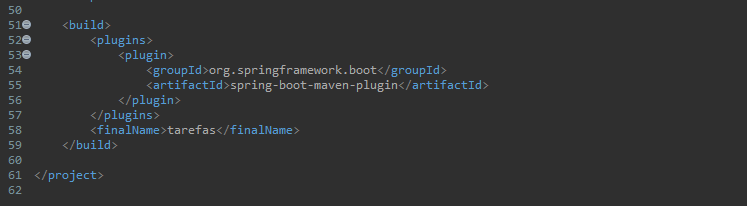

[](https://skillicons.dev)

# Atividade com Sprinboot

Esta atividade tem como objetivo praticar o que foi desenvolvido sobre Springboot e a automatização do GitHub pelo Jenkins, para isso, foi usado a linguagem Java, e o banco de dados com MySQL.

## Ferramentas Utilizadas

- **Eclipse IDE** - É uma IDE para desenvolvimento Java, porém suporta várias outras linguagens a partir de plugins como C/C++, PHP, ColdFusion, Python, Scala e Kotlin. Ele foi feito em Java e segue o modelo open source de desenvolvimento de software.

- **Java** - Linguagem de programação rápida, segura e confiável para codificar tudo, desde aplicações móveis e software empresarial até aplicações de big data e tecnologias do servidores.

- **Springboot** - É um framework que torna fácil a criação de aplicações Spring autossuficientes e robustas, possibilitando a execução imediata.

- **Postman** - É uma plataforma de API para desenvolvedores projetarem, construírem, testarem e iterarem suas APIs.

- **Maven** - é uma ferramenta de automação de compilação utilizada primariamente em projetos Java. Ela é similar à ferramenta Ant, mas é baseada em conceitos e trabalhos diferentes em um modo diferente.

- **MySQL** - É um sistema gerenciador de banco de dados relacional de código aberto usado na maioria das aplicações gratuitas para gerir suas bases de dados, ele utiliza a linguagem SQL (Structure Query Language – Linguagem de Consulta Estruturada), que é a linguagem mais popular para inserir, acessar e gerenciar o conteúdo armazenado num banco de dados.

- **Jenkins** - É um servidor de automação de código aberto. Ele ajuda a automatizar as partes do desenvolvimento de software relacionadas à construção, teste e implantação, facilitando a integração e a entrega contínuas.

- **Docker** - É uma plataforma open source que facilita a criação e administração de ambientes isolados. Ele possibilita o empacotamento de uma aplicação ou ambiente dentro de um container, se tornando portátil para qualquer outro host que contenha o Docker instalado.

## Objetivos

Nesta Atividade foi proposto um cenário onde um gestor precisava organizar suas tarefas de forma mais rapida e eficiente, a aplicação fornece atendimento às necessidade do usuário, permitindo as seguintes funções:

- Listagem das tarefas cadastradas;
- Listagem das tarefas pelo titulo cadastrado;
- Listagem das tarefas filtradas pelo estado delas("Aberto" ou "Finalizado");
- Cadastros de novas tarefas;
- Atualização das informações de tarefas existentes.

---
## Criando o Banco de Dados

A primeira etapa é criar um banco de dado, para isso usaremos a ferramenta *MySQL Workbench*.
Além da criação do banco de dado, será necessário também criar uma tabela com as seguintes informações:

-   **idtarefa**: foi definido como *primary key*(chave primária) e *auto_increment*(auto incrementar) para garantir um controle e identificação de cada tarefa criada;
-   **titulo**: foi definido como *varchar(50)* para armazenar 50 caracteres;
-   **descricao**: foi definido como *text*(texto) para armazenar informações adicionais sobre a tarefa;
-   **datainicio**: foi definida como *Date*(data) para armazenar a data de início da tarefa(formado da data no padrão americado: YYYY/MM/DD);
-   **datatermino**: foi definido como *Date*(data) para armazenar a data de término da tarefa(formado da data no padrão americado: YYYY/MM/DD);
-   **estado**: foi definido como *enum* com dois campos("Aberto" e "Finalizado").

e com isso, o script ficou da seguinte forma:

```
CREATE DATABASE projetotarefasdb CHARSET="utf8mb4" COLLATE="utf8mb4_general_ci";
USE projetotarefasdb;

CREATE TABLE tarefas(
idtarefa bigint auto_increment primary key,
titulo varchar(50) not null,
descricao text not null,
datainicio date not null,
datatermino date not null,
estado enum("Aberto","Finalizado")
)ENGINE InnoDB CHARSET=utf8mb4 COLLATE=utf8mb4_general_ci;
```

# Springboot no Eclipse IDE ou Spring Tools Suite 4

Depois de criar o banco de dados com a tabela, vamos criar um novo Projeto Springboot chamado *ProjetoTarefas* junto com o Maven e o Java 17 também.

---

### **Configuração do application.properties**

Neste arquivo será configurado o Banco de dados como por exemplo o ip do MySQL e a porta do Maven, veja abaixo:
```
spring.datasource.url=jdbc:mysql://172.17.0.2:3306/projetotarefasdb?usessl=false
spring.datasource.username=root
spring.datasource.password=senac@123
spring.jpa.properties.hibernate.dialect=org.hibernate.dialect.MySQL8Dialect
spring.jpa.hibernate.ddl-auto=update

# Porta do servidor Spring
server.port=8095
```

---
### **Camada Domain**

O proximo é o script da camada *domain* com o nome **Tarefas**, que tem como objetivo ser uma tabela semelhante a do banco de dados, veja abaixo:
```
package com.projeto.tarefas.domain;

import java.sql.Date;

import com.projeto.tarefas.repository.Estado;

import jakarta.persistence.Column;
import jakarta.persistence.Entity;
import jakarta.persistence.GeneratedValue;
import jakarta.persistence.GenerationType;
import jakarta.persistence.Id;

@Entity
public class Tarefas {
	@Id
	@GeneratedValue(strategy=GenerationType.IDENTITY)
	@Column(nullable=false)
	private Integer idtarefa;
	
	@Column(nullable=false)
	private String titulo;
	
	@Column(nullable=false)
	private String descricao;
	
	@Column(nullable=false)
	private Date datainicio;
	
	@Column(nullable=false)
	private Date datatermino;
	
	@Column(nullable=false)
	private Estado estado;

	public Tarefas() {
	}

	public Tarefas(Integer idtarefa, String titulo, String descricao, Date datainicio, Date datatermino,
			Estado estado) {
		this.idtarefa = idtarefa;
		this.titulo = titulo;
		this.descricao = descricao;
		this.datainicio = datainicio;
		this.datatermino = datatermino;
		this.estado = estado;
	}

	public Integer getIdtarefa() {
		return idtarefa;
	}
	public void setIdtarefa(Integer idtarefa) {
		this.idtarefa = idtarefa;
	}
	public String getTitulo() {
		return titulo;
	}
	public void setTitulo(String titulo) {
		this.titulo = titulo;
	}
	public String getDescricao() {
		return descricao;
	}
	public void setDescricao(String descricao) {
		this.descricao = descricao;
	}
	public Date getDatainicio() {
		return datainicio;
	}
	public void setDatainicio(Date datainicio) {
		this.datainicio = datainicio;
	}
	public Date getDatatermino() {
		return datatermino;
	}
	public void setDatatermino(Date datatermino) {
		this.datatermino = datatermino;
	}
	public Estado getEstado() {
		return estado;
	}
	public void setEstado(Estado estado) {
		this.estado = estado;
	}
}
```
---
### **Camada Repository**

Depois vem o script da camada *repository* com o nome **TarefasRepository**:
```
package com.projeto.tarefas.repository;

import java.util.List;

import org.springframework.data.jpa.repository.JpaRepository;
import org.springframework.stereotype.Repository;

import com.projeto.tarefas.domain.Tarefas;

@Repository
public interface TarefasRepository extends JpaRepository<Tarefas,Integer> {
	
	public List<Tarefas> findByTitulo(String titulo);
	
	public List<Tarefas> findByEstado(Estado estado);

}
```
Também será necessário criar o arquivo *enum* com o nome **Estado**:
```
package com.projeto.tarefas.repository;

public enum Estado {
	Aberto,
	Finalizado
}
```
---
### **Camada Controller**
Agora na camada *controller*, criaremos o ultimo arquivo Java com o nome **TarefasController**:
```
package com.projeto.tarefas.controller;

import java.util.List;
import java.util.Optional;

import org.springframework.beans.factory.annotation.Autowired;
import org.springframework.web.bind.annotation.GetMapping;
import org.springframework.web.bind.annotation.PathVariable;
import org.springframework.web.bind.annotation.PostMapping;
import org.springframework.web.bind.annotation.PutMapping;
import org.springframework.web.bind.annotation.RequestBody;
import org.springframework.web.bind.annotation.RequestParam;
import org.springframework.web.bind.annotation.RestController;

import com.projeto.tarefas.domain.Tarefas;
import com.projeto.tarefas.repository.Estado;
import com.projeto.tarefas.repository.TarefasRepository;

@RestController
public class TarefasController {
	@Autowired
	private TarefasRepository tr;

	@GetMapping("/tarefas/listar")
	public List<Tarefas> listar() {
		return tr.findAll();
	}
	@GetMapping("/tarefas/listar/{titulo}")
	public List<Tarefas> listarTitulo(@RequestParam String titulo){
		return tr.findByTitulo(titulo);
	}
	@GetMapping("/tarefas/listar/aberto")
	public List<Tarefas> listarAberto(Estado estado){
		return tr.findByEstado(Estado.Aberto);
	}
	@GetMapping("/tarefas/listar/finalizado")
	public List<Tarefas> listarFinalizado(Estado estado){
		return tr.findByEstado(Estado.Finalizado);
	}
	@PostMapping("/tarefas/cadastrar")
	public String cadastrar(@RequestBody Tarefas tarefas) {
		tr.save(tarefas);
		return "Cadastrado";
	}
	@PutMapping("/tarefas/atualizar/{id}")
	public String atualizar(@PathVariable Integer id, @RequestBody Tarefas tarefas) {
		String msg = "";
		Optional<Tarefas> t = tr.findById(id);
		
		if(t.isPresent()) {
			tarefas.setIdtarefa(id);
			tr.save(tarefas);
			msg = "Tarefa Atualizada";
		}
		else {
			msg = "Tarefa não Encontrada";
		}
		return msg;
	}
}
```
---
## Dockerfile e pom.xml

Agora é chegado o a ultima parte dentro do Eclipse IDE ou do Spring Tools Suite 4.
Iremos criar o arquivo chamado *Dockerfile* com o script abaixo:
```
FROM openjdk:17
EXPOSE 8095
ADD target/tarefas.jar tarefas.jar
ENTRYPOINT ["java","-jar","tarefas.jar"]
```
Depois disso, abra o arquivo pom.xml e nas ultimas linhas adicione o seguinte comando:
```
<finalName>tarefas</finalName>
```
Veja por uma imagem ilustrativa abaixo:


### *Agora é só enviar para um repositório no GitHub!*
---
## Criando a Imagem da Aplicação

Dentro do Servidor Linux(no meu caso o Fedora), clonaremos o repositório que criamos no GitHub:
```
$ git clone https://github.com/seuperfil/seurepositorio
```
Entre na pasta criada do repositório:
```
$ cd seurepositorio
```
Será necessario instalar o arquivo jar com o Maven:
```
$ mvn clean install
```
E então gerar a imagem:
```
$ docker build -t nomedaimagem .
```
Agora precisamos criar o container:
```
docker run --name=nomedocontainer -p 8095:8095 nomedaimagem
```
Caso dê certo o terminal irá ficar travado, para destrava basta usar o atalho no teclado **Ctrl + C**.